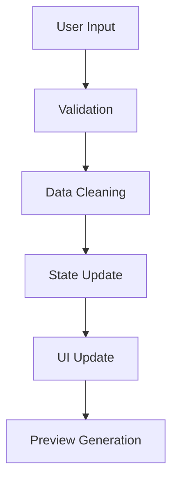
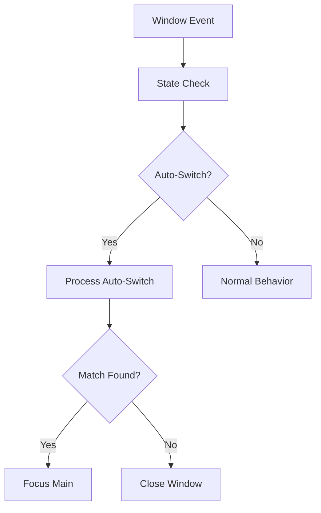
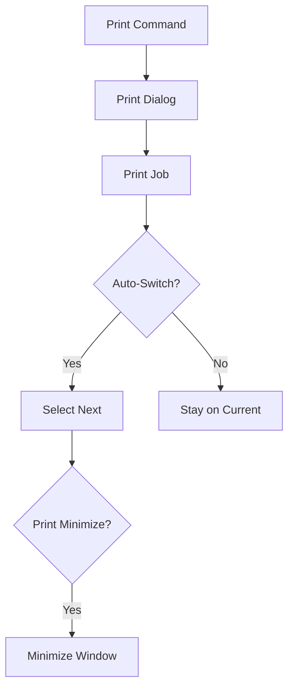

# Technical Documentation

## Table of Contents

- [Architecture Overview](#architecture-overview)
  - [Core Components](#core-components)
  - [UI Components](#ui-components)
  - [Utilities](#utilities)
- [Component Interaction Diagram](#component-interaction-diagram)
- [Data Flow and State Management](#data-flow-and-state-management)
- [Settings Management](#settings-management)
- [Image Processing Pipeline](#image-processing-pipeline)
- [Error Handling and Recovery](#error-handling-and-recovery)
- [Performance Optimization](#performance-optimization)
- [Testing and Quality Assurance](#testing-and-quality-assurance)
- [Security Considerations](#security-considerations)
- [Future Improvements](#future-improvements)

## Architecture Overview

The application follows a modular architecture with clear separation of concerns:

### Core Components

1. **Main Application (`main.pyw`)**
   - Entry point and window initialization
   - Single instance enforcement via Windows mutex
   - Global exception handling and logging
   - Resource cleanup on exit
   - Window state management

2. **Barcode Generator (`src/barcode_generator.py`)**
   - Label generation and image processing
   - Font management and text positioning
   - Barcode creation and validation
   - Image quality optimization

3. **Configuration (`src/config.py`)**
   - Settings management and persistence
   - User preferences handling
   - File path resolution
   - Default value management

### UI Components (`src/ui/`)

1. **Main Window (`main_window.py`)**
   - Primary interface implementation in `MainWindow` class
   - Key functions:
     ```python
     # Window Creation and Setup
     def _create_styled_button()  # Custom button styling
     def _create_input_fields()   # Input field management
     def _create_action_buttons() # Action button creation
     def _setup_window_state()    # Window state initialization
     
     # Label Operations
     def preview_label()          # Real-time preview updates
     def save_label()            # Label file management
     def print_label()           # Print handling with delays
     
     # Window Management
     def toggle_window_on_top()  # Pin window functionality
     def toggle_mirror_print()   # Mirror printing control
     def toggle_auto_switch()    # Auto-switch behavior
     def toggle_print_minimize() # Print minimize control
     ```

2. **View Files Window**
   - Search and preview functionality
   - Toggle controls with visual feedback:
     ```python
     # Toggle States
     self.is_mirror_print = tk.BooleanVar()    # Mirror print
     self.is_auto_switch = tk.BooleanVar()     # Auto-switch
     self.is_print_minimize = tk.BooleanVar()  # Print minimize
     
     # Toggle Functions
     def toggle_mirror_print()    # Flips label output
     def toggle_auto_switch()     # Smart window management
     def toggle_print_minimize()  # Window minimize after print
     ```
   - Window behavior states:
     ```json
     {
       "auto_switch": {
         "no_match": "close_window",
         "single_match": "focus_main",
         "multiple_matches": "stay_open"
       },
       "print_minimize": {
         "delay": 1500,
         "condition": "after_print"
       }
     }
     ```

3. **Window Manager**
   - Implemented in `WindowManager` class
   - Window positioning and focus management
   - Drag functionality for all windows
   - Window state persistence

4. **UI Components and Styling**
   - Button styling with hover effects:
     ```python
     BUTTON_COLORS = {
         'default': {'bg': '#3498db', 'fg': 'white'},
         'hover': {'bg': '#2980b9'},
         'active': {'bg': '#2473a6'},
         'disabled': {'bg': '#bdc3c7'}
     }
     ```
   - Tooltips implementation:
     ```python
     class ToolTip:
         PROPERTIES = {
             'bg': '#ffffe0',
             'font': ('TkDefaultFont', 8),
             'relief': 'solid',
             'borderwidth': 1
         }
     ```

### Utilities (`src/utils/`)

1. **Logger**
   - Rotating file logs with size limits
   - Console output for debugging
   - Error tracking and reporting

2. **CSV Processor**
   - Batch label processing
   - Data validation and cleaning
   - Progress tracking

## Component Interaction Diagram

The Label Maker application follows a modular design where components interact through well-defined interfaces. Below is a high-level overview of how the components interact:

```
┌─────────────────┐      ┌───────────────────┐      ┌───────────────────┐
│                 │      │                   │      │                   │
│   main.pyw      │◄────►│   MainWindow      │◄────►│  ViewFilesWindow  │
│   (Entry Point) │      │   (Primary UI)    │      │  (File Management)│
│                 │      │                   │      │                   │
└────────┬────────┘      └─────────┬─────────┘      └─────────┬─────────┘
         │                         │                          │
         │                         │                          │
         │                         ▼                          │
         │               ┌───────────────────┐                │
         └──────────────►│  WindowManager    │◄───────────────┘
                         │  (Window Control) │
                         └─────────┬─────────┘
                                   │
                                   │
         ┌─────────────────────────┼─────────────────────────┐
         │                         │                         │
         ▼                         ▼                         ▼
┌─────────────────┐      ┌───────────────────┐      ┌───────────────────┐
│                 │      │                   │      │                   │
│ ConfigManager   │◄────►│ BarcodeGenerator  │      │ Event System      │
│ (Settings)      │      │ (Label Creation)  │      │ (Communication)   │
│                 │      │                   │      │                   │
└─────────────────┘      └───────────────────┘      └───────────────────┘
         ▲                         ▲                          ▲
         │                         │                          │
         └─────────────────────────┼──────────────────────────┘
                                   │
                                   ▼
                         ┌───────────────────┐
                         │                   │
                         │ Utility Functions │
                         │ (Helpers)         │
                         │                   │
                         └───────────────────┘
```

### Key Interactions

1. **Main Script to Windows**
   - `main.pyw` initializes the `MainWindow` class
   - Handles single instance enforcement
   - Sets up global exception handling

2. **MainWindow to ViewFilesWindow**
   - `MainWindow` creates and manages the `ViewFilesWindow`
   - Passes label data and settings between windows
   - Coordinates focus management based on auto-switch settings

3. **Windows to WindowManager**
   - Both window classes use `WindowManager` for:
     - Window positioning
     - Focus management
     - Drag functionality
     - State persistence

4. **Windows to BarcodeGenerator**
   - `MainWindow` uses `BarcodeGenerator` to:
     - Create label previews
     - Generate final label images
     - Validate barcode input

5. **All Components to ConfigManager**
   - Components access settings through `ConfigManager`
   - Settings are loaded at startup and saved when changed
   - Default values are provided when settings are missing

6. **Inter-Component Communication via Events**
   - Custom events allow loose coupling between components
   - Events include:
     - Preview updates
     - Save completion
     - Print operations
     - Window state changes

7. **Utility Functions**
   - Shared helper functions used by multiple components
   - Include file operations, validation, and data processing

## Data Flow and State Management

### 1. Input Processing


### 2. Window State Management


### 3. Print Flow


## Settings Management

### Configuration File Structure
```json
{
    "window_settings": {
        "font_size_large": 45,
        "font_size_medium": 45,
        "transparency_level": 0.9,
        "always_on_top": false
    },
    "label_settings": {
        "barcode_width": 600,
        "barcode_height": 310,
        "DPI": 300,
        "LABEL_WIDTH": 600,
        "LABEL_HEIGHT": 600
    },
    "view_files_settings": {
        "mirror_print": false,
        "pin_window": false,
        "auto_switch": true,
        "print_minimize": false
    },
    "application_state": {
        "last_directory": null,
        "label_counter": 0,
        "window_positions": {}
    }
}
```

## Image Processing Pipeline

### Label Generation Process
1. **Text Processing**
   - Font loading and size calculation
   - Text wrapping and positioning
   - Dynamic spacing adjustment

2. **Barcode Generation**
   - UPC validation and formatting
   - Barcode image creation
   - Size and quality optimization

3. **Image Assembly**
   - Canvas creation and sizing
   - Component placement
   - Mirror transformation if enabled

### Preview System
1. **Real-time Updates**
   - Efficient image scaling
   - Memory management
   - Cache implementation

2. **Size Management**
   - Three preview sizes (3->4->5)
   - Aspect ratio preservation
   - Quality optimization

## Error Handling and Recovery

### Exception Hierarchy
```python
class LabelMakerError(Exception): pass
class ConfigError(LabelMakerError): pass
class BarcodeError(LabelMakerError): pass
class PrintError(LabelMakerError): pass
```

### Error Recovery Strategies
1. **Configuration Errors**
   - Default value fallback
   - Configuration repair
   - User notification

2. **Print Errors**
   - Print job monitoring
   - Retry mechanism
   - Error reporting

3. **File System Errors**
   - Path validation
   - Permission checking
   - Alternative path fallback

## Performance Optimization

### Memory Management
1. **Image Handling**
   - Preview caching
   - Resource cleanup
   - Memory monitoring

2. **Window Management**
   - Efficient state tracking
   - Event debouncing
   - Resource pooling

### File Operations
1. **Directory Scanning**
   - Asynchronous operations
   - Filtered scanning
   - Cache implementation

2. **File Access**
   - Buffered operations
   - Path optimization
   - Permission caching

## Testing and Quality Assurance

### Test Categories
1. **Unit Tests**
   - Component isolation
   - Input validation
   - Error handling

2. **Integration Tests**
   - Window interaction
   - Print workflow
   - File operations

3. **Performance Tests**
   - Memory usage
   - Response times
   - Resource cleanup

## Security Considerations

1. **File System**
   - Path sanitization
   - Permission validation
   - Secure file operations

2. **User Input**
   - Input validation
   - XSS prevention
   - Path traversal protection

## Future Improvements

1. **UI Enhancements**
   - Additional preview sizes
   - Layout stability
   - Responsive design

2. **Performance**
   - Faster preview generation
   - Better memory management
   - Optimized file operations

3. **Features**
   - Additional print options
   - Enhanced batch processing
   - Extended file format support
